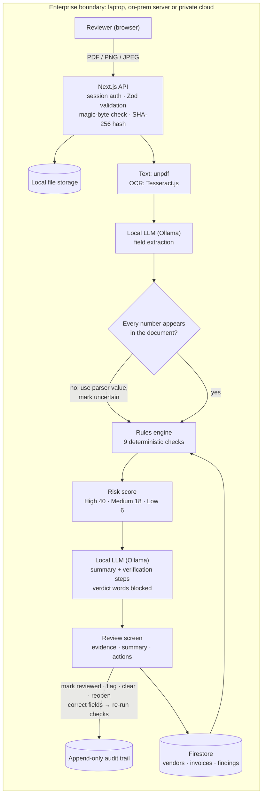

# InvoiceShield AI — Hackathon Submission

**Stixor AI Hackathon 2026 · Sovereign AI for Enterprise** · Team: [Team name] · Repo: [github.com/your-repo]

## Solution description

Payables teams lose money to invoices that look normal: duplicates re-sent as "reminders", real vendors whose bank details
have "changed", and look-alike vendor names. Catching them means cross-checking every invoice against the vendor master and
payment history, which nobody has time for at month-end. And invoices are exactly the data a company can't send to a cloud AI:
bank accounts, supplier pricing, payment timing.

**InvoiceShield** is a sovereign AI invoice reviewer. A **local LLM** (Ollama, qwen2.5 3B) reads any invoice PDF or scan into
structured fields. **Nine deterministic rules** check it against the vendor register and invoice history: duplicate file,
duplicate or near-duplicate number, unknown or look-alike vendor, unapproved vendor, changed bank account, amount outside range
or a statistical outlier, and arithmetic errors. Each finding carries its evidence. The local model then writes a plain-language
summary and verification steps. A **person decides** (review, flag, clear, reopen, or correct fields and re-run checks), and every
action goes into an **append-only audit trail**.

The AI is guarded: a number from the model is kept only if it appears in the document; verdict words such as "fraud" or
"safe to pay" are rejected; findings and scores come only from rules; and if the model is unavailable the app falls back to
rules-only and says so. Invoice text never leaves the machine. Nothing is approved, rejected or paid automatically.

**End-to-end workflow demonstrated:** upload → local extraction → checks → risk score → local explanation → human review → audit trail.
All demo data is synthetic (fictional vendors, generated invoices).

## Architecture / workflow



| Layer | Choice | Why |
|---|---|---|
| AI | Ollama + qwen2.5 3B (any open model) | Runs locally on ordinary hardware; no data leaves |
| Documents | unpdf, Tesseract.js | PDF text and OCR without a cloud service |
| Checks | Pure TypeScript rules, Vitest | Deterministic, explainable, versioned, unit-tested |
| App | Next.js 16, TypeScript, Tailwind, Zod | One codebase; every request validated and ownership-checked server-side |
| Data | Firebase Auth + Firestore (emulators for on-prem), local file storage | Locked-down rules, Admin SDK only |

## Run it

```bash
npm install
npm run emulators      # terminal 1, fully local data store
npm run dev:emulator   # terminal 2, http://localhost:3000
```

Then `ollama pull qwen2.5:3b`, sign up, **Load synthetic demo data**, and upload the samples in `public/samples/`.
The live demo script is in [DEMO.md](DEMO.md).
